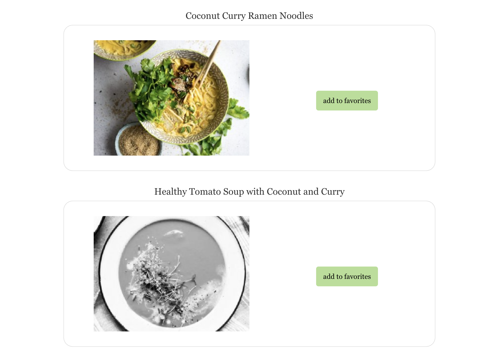
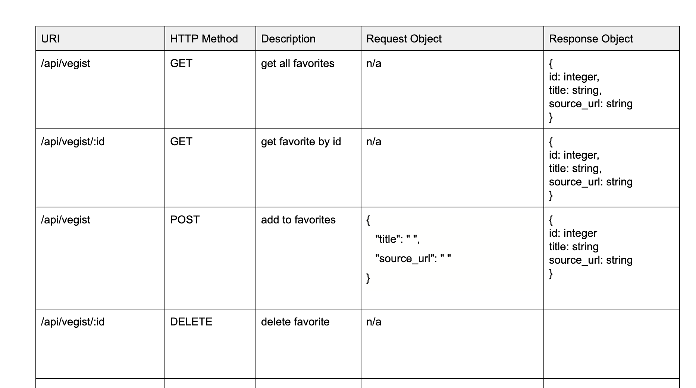

# Vegist 

## Project Description 

**Vegist** is a simple Vegan recipe search engine app that fetches data from spoonacular food API.

This is a fullstack project that was build using React, Node/Express, and MySQL.




## Project Setup 

### Dependencies

- Run `yarn` in the project folder to install dependencies related to Express.

- `cd client` and run `yarn` install dependencies related to React.

### Database

- Create `.env` file in project directory and add:

```
DB_NAME=vegist
DB_PASS=YOUR_PASSWORD
```
- Type `mysql -u root -p` to access the MySQL CLI using your password.

- In the MySQL CLI, type `create database vegist;` to create a database in MySQL.

### Development Servers

- Run `yarn start` in project directory to start the Express server on port 5000
- `cd client` and run `yarn start` to start client server in development mode with hot reloading in port 3000.
- Test client with: `http://localhost:3000`
- Test API with: `http://localhost:5000/api`

## API Routes Design



## Resources

API: https://spoonacular.com/food-api

## Notes

_This is a student project that was created at [CodeOp](http://codeop.tech), a full stack development bootcamp in Barcelona._

